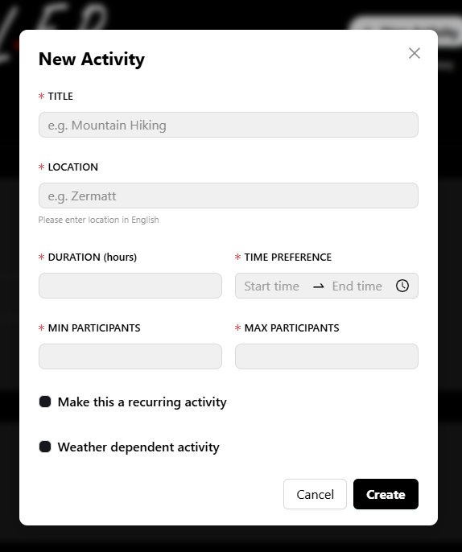
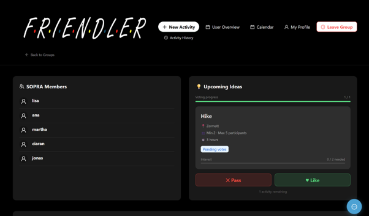
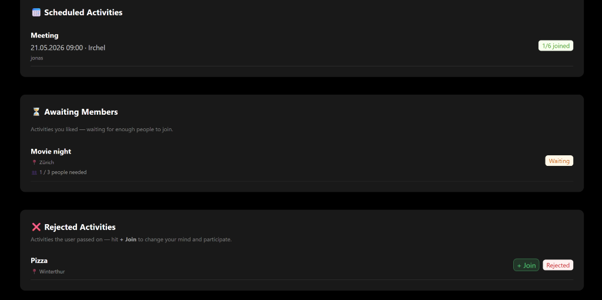
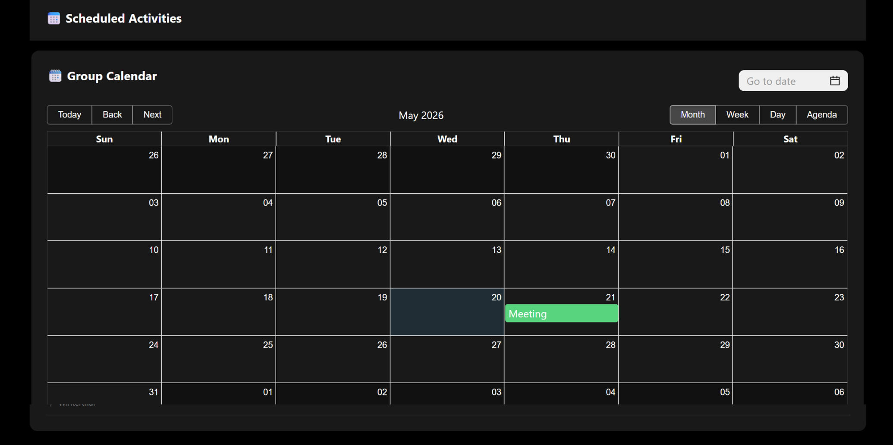
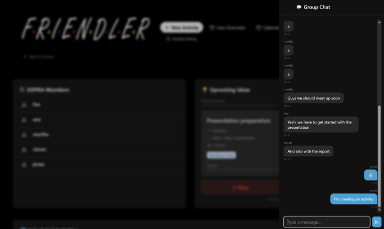
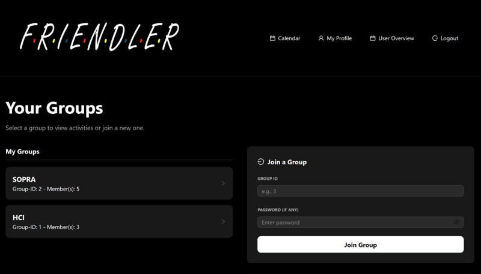

## Friendler

Welcome to Friendler, a web-based group activity planning app that takes the hassle out of coordinating plans with friends. Create groups, propose activities, vote on them, and let Friendler automatically find a time that works for everyone — checking calendars and even the weather.

## Table of Contents

-   [Introduction](#introduction)
-   [Technologies](#technologies)
-   [High-level components](#high-level-components)
-   [Launch & Deployment](#launch--deployment)
-   [Illustrations](#illustrations)
-   [Roadmap](#Roadmap)
-   [Authors & Acknowledgement](#authors--acknowledgement)
-   [Licence](#license)

## Introduction

### Mission

Life’s better together, we make sure it actually happens.

### Project Goal & Motivation

A common challenge in social life is not the lack of willingness to meet, but the difficulty of
coordinating plans. People often suggest activities, but these ideas rarely become reality
because finding both a shared interest and a suitable date among multiple people is
complicated and time-consuming. Existing tools like chats or calendars only solve parts of
the problem: discussions happen in messaging apps, while calendars require a decision to
already be made.
Our application reverses this process. Instead of fixing a date first, users are matched based
on interest in an activity. Within a group, users propose activities with time ranges and
participant limits, and others can vote on them, similar to a dating app. Once an activity
reaches the minimum number of participants, the system analyzes users’ availability from
their submitted calendars and proposes an optimal date. Users specify a location and mark
activities as weather-dependent. The system then uses a Weather API to check forecast
conditions and determine whether the activity should take place or be rescheduled.

## Technologies

For our application, we relied on the following TechStack:

-   [Java](https://www.java.com/de/): Primary backend language
-   [SpringBoot](https://spring.io/): Backend framework for REST API and scheduling
-   [Next.js](https://nextjs.org/): React-based frontend framework
-   [Ant Design](https://ant.design/): UI component library
-   [H2 Database](https://www.h2database.com/html/main.html): In-memory database for development
-   [Google Calendar API](https://developers.google.com/calendar): OAuth2-based calendar sync
-   [Open-Meteo API](https://open-meteo.com/): Weather forecasting for weather-dependent activities
-   [Google Cloud](https://cloud.google.com/): Deployment platform
-   [Vercel](https://vercel.com/): Frontend deployment platform
-   [Gradle](https://gradle.org/): A fast and dependable open-source build automation tool
-   [SonarQube](https://sonarcloud.io/): Ensuring test coverage

## High Level Components

### [GroupsIdPage](https://github.com/jonasbisang/sopra-fs26-group36-client/blob/main/app/groups/%5Bid%5D/page.tsx)

The core of the application. Handles the full activity lifecycle from creation through scheduling. Key responsibilities:

- Creating activity proposals
- Processing votes and triggering scheduling when the minimum number of participants is reached
- Finding available time slots by cross-referencing all participant unavailabilities
- Checking weather forecasts
- Classifying activities into Scheduled, Pending, and Rejected states
- Joining rejected or scheduled activities
- Group Calendar
- Group Chat 

### [GroupsPage](https://github.com/jonasbisang/sopra-fs26-group36-client/blob/main/app/groups/page.tsx)

Manages the group system that underpins all group coordination. Handles:

- Group creation
- Joining a group 


### [UsersCalendar](https://github.com/jonasbisang/sopra-fs26-group36-client/tree/main/app/users/%5Bid%5D/calendar)

Bridges Friendler with the user's Calendar. Includes:

- The user's upcoming events
- The user's calendar containing all events
- The user's marked unavailabilities


### [UserIdSettingsPage](https://github.com/jonasbisang/sopra-fs26-group36-client/tree/main/app/users/%5Bid%5D)

Manages user account and authentication. Handles:

- Data visualization 
- Profile updates (username, bio, password)


## Launch & Deployment

### Prerequisites

- Java 17+
- Node.js 18+
- Gradle

### Frontend

#### Install dependencies

```bash
npm install
```

#### Run locally

```bash
npm run dev
```

The frontend runs at `http://localhost:3000`.

#### Environment Variables

Create a `.env.local` file in the frontend root:

```
NEXT_PUBLIC_PROD_API_URL=https://your-backend-url.com
```

## Illustrations

### 1. Activity Lifecycle (GroupsIdPage)


*Users can easily propose new activities, set participant limits, and vote on what to do.*



*The system automatically handles the lifecycle, calculating the optimal date once the minimum participant threshold is reached and the weather checks out. Users can vote and join activities. All members are displayed, along with a dedicated settings page for the group admin.*



*Contains the group calendar.*



*Contains the group chat.*




### 2. Group Management (GroupsPage)
 


*The central hub for coordinating with friends. Users can create distinct groups, join existing ones via invite, and manage group administration seamlessly.*


### 3. Users Calendar (UsersCalendar)


*Friendler bridges directly with the user's calendar to seamlessly streamline group scheduling. The system provides a comprehensive calendar view containing all scheduled activities, and tracks marked unavailabilities to ensure no conflicting plans are made.*

### 4. Users Settings (UserIdSettingsPage)


*This page provides intuitive data visualization to help users track their personal activity metrics, while also offering a direct interface for updating profile information such as usernames, personal bios, and passwords.*


## Roadmap

Features that new developers could implement to expand Friendler:

### Location-aware Activity Planning with Google Maps

Currently activity locations are stored as plain text strings. Integrating the Google Maps API would allow users to enter and pin a real address when proposing an activity, display an embedded map preview on the activity detail page, and calculate travel time from each participant's home address to the activity location. This would make scheduling smarter — for example, only proposing time slots where everyone can realistically arrive on time.

Suggested implementation:

- Add a `homeAddress` field to the `User` entity
- Use the [Google Maps Geocoding API](https://developers.google.com/maps/documentation/geocoding) to resolve addresses to coordinates
- Use the [Google Maps Distance Matrix API](https://developers.google.com/maps/documentation/distance-matrix) to estimate travel times per participant
- Replace the plain text location input in `CreateActivityModal.tsx` with a Maps autocomplete field
- Display an embedded map preview on the activity detail page

### Hourly Weather Forecasting for Smarter Scheduling

The current weather check uses daily min/max temperature and total precipitation to decide whether a date is suitable. This means an activity could be scheduled on a day that is mostly sunny but has one rainy hour in the evening. Switching to an hourly forecast would allow Friendler to match the specific scheduled time window against the actual forecast for those hours, producing much more accurate weather-dependent scheduling.

Suggested implementation:

- Update `checkWeather()` in `ActivityService.java` to use the `hourly` endpoint of the [Open-Meteo API](https://open-meteo.com/) instead of `daily`
- Extract only the forecast hours that overlap with the activity's time window
- Evaluate temperature and precipitation against the activity's requirements for those specific hours only

### Activity Comments & Discussion

Allow group members to leave comments on a specific activity proposal before voting, so they can discuss logistics without cluttering the group chat.

Suggested implementation:

- Add a `Comment` entity linked to `Activity` and `User`
- New REST endpoints: `POST /groups/{groupId}/activities/{activityId}/comments` and the corresponding `GET`
- Display a comment thread on the activity detail page


## Authors & Acknowledgement

-   [Jonas Bisang](https://github.com/jonasbisang)
-   [Martha von Holly](https://github.com/vonhollym-art)
-   [Ciaran Hendriks](https://github.com/CiaranHendriks)
-   [Elisabetta De Donno](https://github.com/elisabettade)
-   [Ana Nistal Escudero](https://github.com/ananis299)

And a special thank you to our Teaching Assistant [Ceyhun Acikmese](https://github.com/Agravlin) for supporting us during the development.

## License

This Project SpyQuest is licensed under Apache License 2.0 -see the [LICENSE](https://github.com/jonasbisang/sopra-fs26-group36-server/blob/main/LICENSE) file for further details.